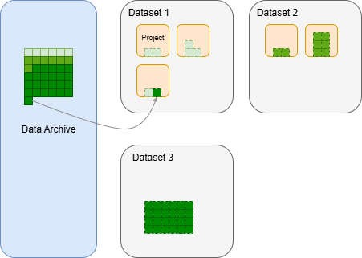

# 1 简介
PMTaro是一款全流程的医学影像数据治理单机软件。主要针对医学影像DICOM和NFITI数据格式，实现了读图，阅片，PACS数据存储，数据标注，报告书写和自定义数据处理工作流。本软件可以一体式地完成原始DICOM数据从医院PACS系统的接入到数据分析的全流程使用，以此实现医学影像数据处理的一致性，可追溯性，降低数据处理的门槛，便于后处理方案的落地。

软件支持多模态数据，以下为主要支持的数据格式：
- 医学影像类
    - DICOM
    - NFITI
    - NRRD
    - TIFF
- 通用图像类
    - JPEG
    - PNG
    - GIF
- 文本类
    - TXT
    - PDF
    - Markdown
- 结构化数据
    - JSON
    - XML
    - CSV
    - EXCEL

软件支持DICOM和dicomweb通讯标准，可以作为本地DICOM server存储数据和与其他支持DICOM标准的客户端通讯（如导入/导出数据）。
软件支持FHIR标准，用于存储影像及其相关模态的数据，如血检，病理切片，诊断报告等。

本软件是一款单机软件，用户无需上传数据即可完成对数据的操作，一切操作均只针对本地数据，且只使用用户本地电脑完成处理。免费用户甚至可以完全离线使用软件。

## 设计逻辑
PMTaro是一个以医学影像数据集(Dataset)为基本单位的数据治理软件。在数据集的基础上形成了 “Dataset → Project → Patient → Study → Series → Instance”的层级逻辑。每个层级之间都是一对多关系，即一个Datset里可以有N个Project，以此类推。

以Dataset为首层，是考虑到一切下游任务都要基于完整可靠的“数据集”。数据集可以是一个抽象的概念，可定义为：按照一定的规律收集的一组数据，且具备高质量，隐私性，合规性，可追溯性的特点。PMTaro以帮助用户产出这样的数据集为首要目标。

Dataset之下是Project层，Project是用户开始进行数据操作的基本单位。在大规模和多中心合作的数据集构建场景下，整个Dataset会被分割成多个子块，进而可以将每个子块分配给多人或多次处理，一个Project就是这样的一个子块。当Dataset被创建后，Dataset的作者/上级管理者应将整个数据集划分出合适数量的Project，调整每个Project内所包含的Patient（Project的下一级），规划数据处理进度。如Project1应在第一周完成，Project2应在第二周完成；或是，Project1交给用户A完成，Project2交给用户B完成。当然用户也可以以不同思路分配Project，如Project1中只放清洗出来的高质量数据，Project2中放有瑕疵的数据，Project3中放应被剔除的数据。以上操作均可在此软件中完成。

Patient-Study-Series-Instance的四层结构为[NEMA的DICOM设计标准](https://www.dicomstandard.org/)，即对一个病人一次检查，算作一个Study，这次检测中扫描了10个序列，算作10个Series，某个序列中采集了100个断层，算作100个Instance。一般情况下，DICOM格式的数据中保存了唯一可用于识别的Study，Series，Instance的UID，但是Patient则无法确保唯一性。因此Patient的唯一性由本软件维护。

此外，Patient-Study-Series-Instance的四层结构不只是用于对医学影像数据的存储，还包括了电子健康记录（Electronic Health Record, EHR）等其他模态数据的记录，以及合规文件等。如EHR属于Patient层，病人扫描同意书属于Study层。非影像模态的数据可以以附件的形式存储在任意层级，或是直接被软件数字化为结构化信息。

## 数据存储逻辑

当数据导入Dataset时，实际上是把原数据存储在数据档案库（Data Archive）,同时把数据的索引放到Dataset中（如上图所示）。用户可以查看到完整的Data Archive的数据，并决定将哪个数据分配给哪个Dataset，我们把这个过程称之为Data Rearangement。这种设计会极大有利于以下场景：
- 场景一：Dataset1中存在适合Dataset2的数据。借助此设计，用户无需重新将Dataset1的原数据导入Dataset2。
- 场景二：软件中已经存储了Dataset，数据总量非常大了。用户想对数据再利用，从全部数据中找出合适数据构成一个新的Dataset。
- 场景三：用户忘记了自己已经导入过一批数据，现在又重新导入了重复的数据。此设计可以避免重复导入，占用额外硬盘空间。

## 设备需求
Name: PMTaro Version: 1.0.0 
Developer: PMTaro Team Intended 
操作系统: Windows 10/11 32-bit

最低配置需求
内存: 2 GB RAM
硬盘存储空间: 1GB 
CPU: 双核 2.4 GHz
GPU: （由插件需求决定）

推荐配置需求
内存: 8 GB RAM
硬盘存储空间: 10 GB 
CPU: 四核 2.4 GHz
GPU: （由插件需求决定）

## 用户手册
此用户手册将会对软件的：
- 数据导入/导出
- 读图/阅片
- 项目创建
- 数据
    - 管理
    - 清洗
    - 标注
    - 报告书写
- 插件
- 工作流
等模块进行详细的使用说明，旨在帮助用户了解软件设计目标并熟悉如何实现各种常见数据处理任务。

PMTaro是源码闭源的商业软件，需要与以下第三方开源软件（均会自动安装）结合使用：
- [Postgresql](https://www.postgresql.org/)
- [Orthanc](https://www.orthanc-server.com/)