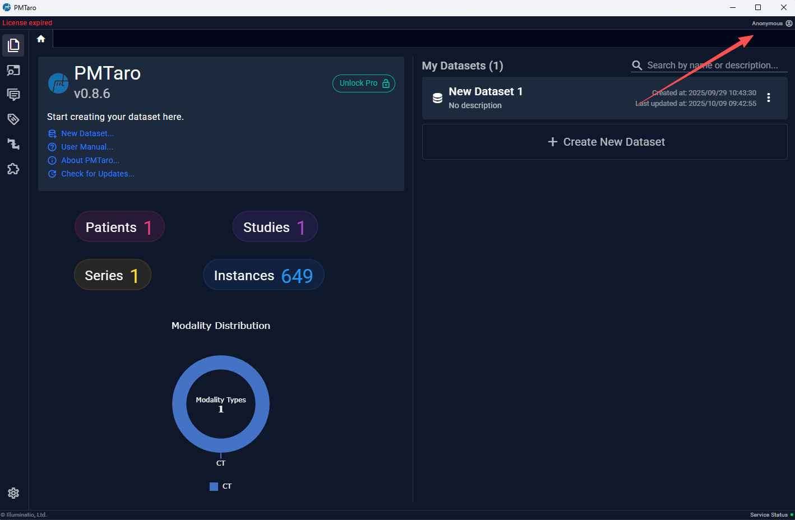
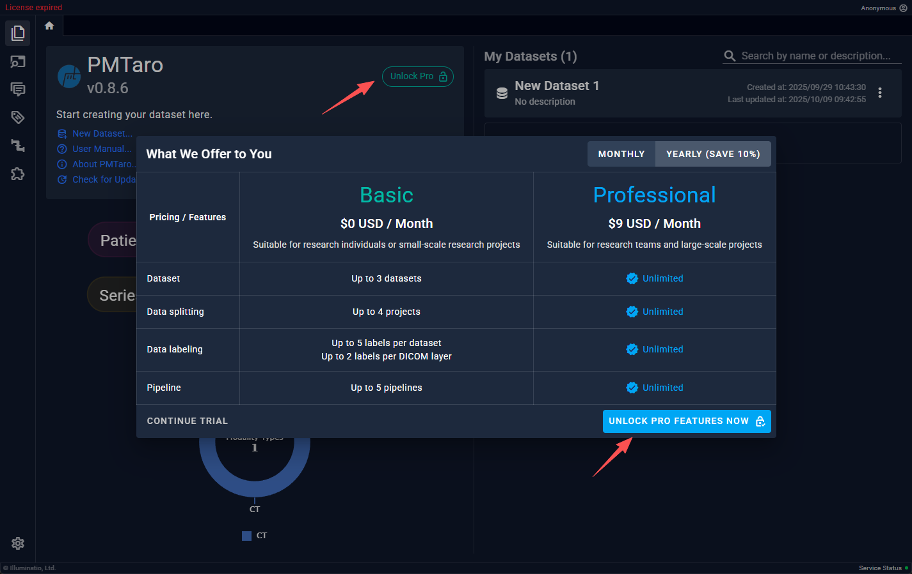
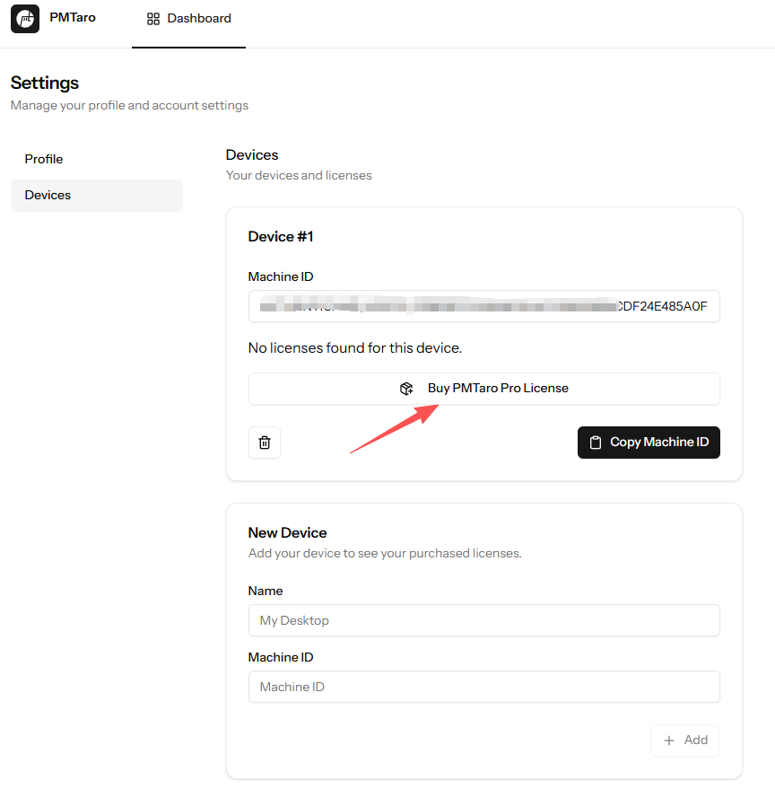

# 3.2 激活

## 用户登录

首次打开软件时，默认为未登录状态，右上角可以看到当前的用户。点击“未登录”弹出邮箱验证窗口，完成邮箱验证即可登录成功。
注意：用户登陆后，会一直保持此用户状态，关闭软件再次打开时依旧自动未上次登录的账号。

## 查看激活证书
联网状态下登录用户，右键点击软件右上角的用户名，选择“我的证书”，即会弹出此用户信息的网页，用户选择左侧列表的“设备”，即可查看当前所拥有的证书。注意：一个证书只能同时绑定一个机器码。

## 获取激活证书
需要通过购买的方式获取 PMTaro Pro 激活证书。
注意：一个证书必须绑定一台设备，用户可以额外添加设备并为添加的设备购买新的证书。

### 购买
用户可以选择软件内或网页购买。两种购买方式都需要用户在联网的情况下先登录账户。

软件内购买：点击“解锁专业版”，在弹出的窗口右下角点击“解锁专业版”，在购买页面中完成购买即可。

网页购买：在个人用户网页的左侧“设备”选项卡中点击 “购买PMTaro Pro证书”，在购买页面中完成购买即可。

## 激活
激活的前提是用户已经拥有了与本机匹配的证书。
激活分两种方式：离线和在线激活

### 离线激活

在安装器界面的激活选项卡中，选择“激活已经在使用的证书”，然后添加证书文件即可

### 在线自动激活
进入网页端的用户设备界面，点击“下载证书”，即可自动为本地软件添加证书
