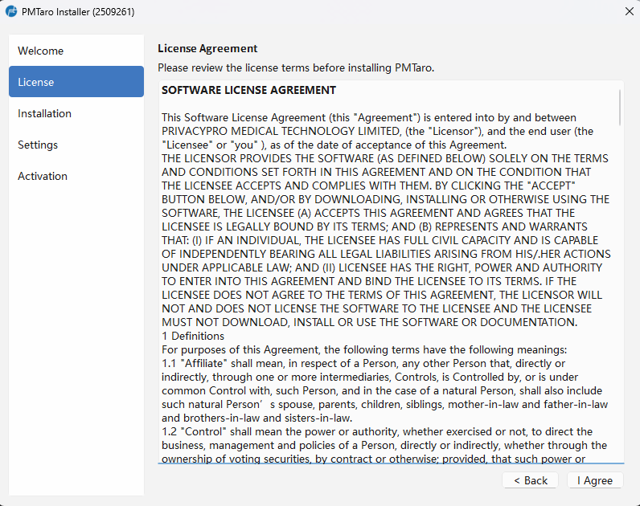
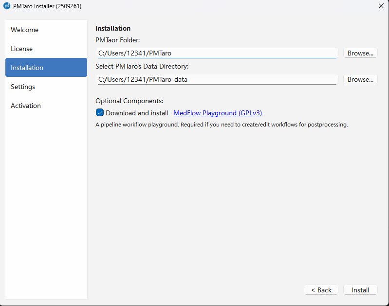
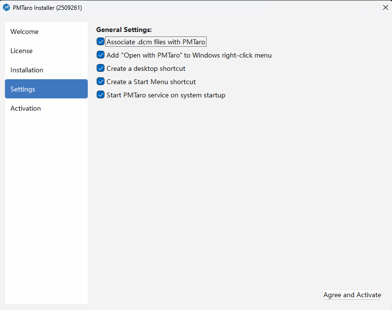
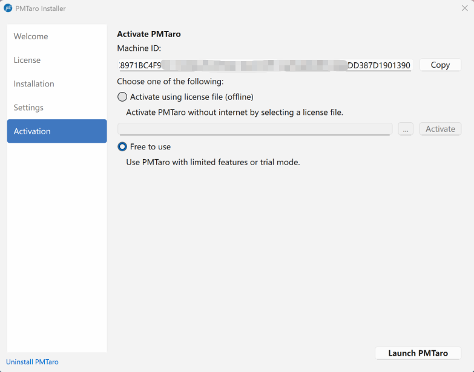

# 3.1 下载和安装
本软件是单机版，用户可以通过官网获取下载器的PMTaro Installer.exe的链接，后续的安装，更新，卸载功能均包含在此下载器中。注意：下载过程需要联网。

第一步: 双击PMTaro Installer.exe进入下载和安装界面。可即时查看所要下载的版本的更新日志。点击“下一步”。

第二步：查阅和同意本软件的用户同意书。点击“同意”。

第三步：选择软件本地和软件数据的安装路径。软件本体包括软件的核心代码以及用户插件代码。

软件数据文件主要包括以下内容：
- 用户的DICOM原数据
- 用户的本地插件源码
- 用户的数据集和项目记录（各种元数据）
- 日志文件
- 缓存文件

此步用户可以取消勾选下载安装MedFlow Playground（不推荐），如果不勾选则无法定制化使用软件的工作流等相关功能。

点击“安装”会自动下载并安装全部所需组件

第四步：安装完毕，进入可选性设置。有以下五个可选项，默认全部勾选（推荐）
- 自动关联后缀名为 .dcm 的文件（用户可以双击.dcm文件直接用PMTaro打开读图）
- 在鼠标右键菜单中加入“以PMTaro打开”的选项（可以直接打开文件或文件夹，进入快速读图界面）
- 创建桌面快捷方式
- 创建开始菜单快捷方式
- 开机启动PMTaro服务 

第五步：选择激活方式。目前提供以下几种方式：
- 免费试用：不需要激活，但部分功能受到限制。
- 通过证书文件激活：需要用户已经付费购买并获取过证书文件，主要用于离线情况使用软件的情况。