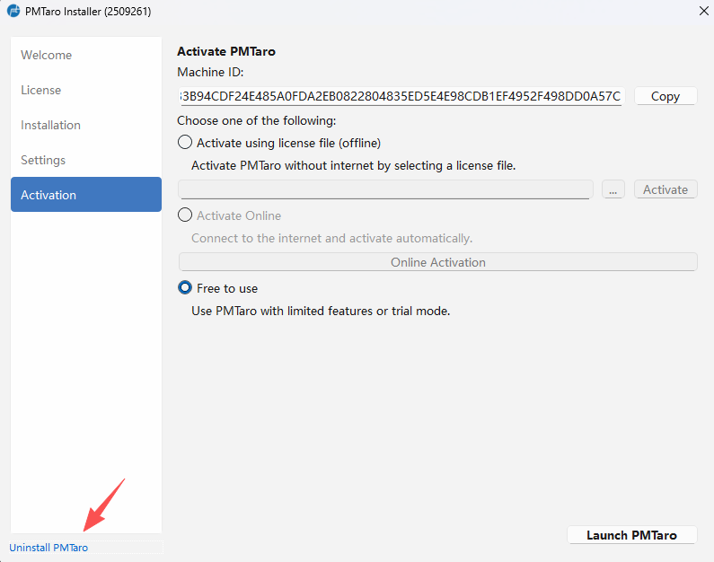
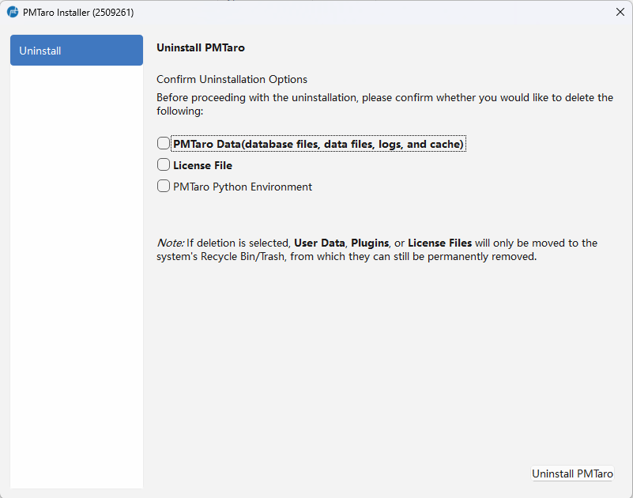

# 卸载
用户可以直接使用控制面板的“添加和删除程序”删除软件，或是通过PMTaro Installer.exe（下载和安装时用过的）

如果使用PMTaro Installer.exe，则应用以下流程

第一步：打开PMTaro Installer.exe，点击左下角的“卸载PMTaro”

第二步：除了卸载软件本体，还提供了以下可选项：
- PMTaro数据：包括用户自己的DICOM数据，本地插件代码，曾经运行时输出的结果，日志文件等。
- 证书文件：用户激活软件时所使用的证书。如果勾选（删除），下次安装软件时仍需要重新激活软件。如果不勾选（保留），下次安装软件且证书未过期的话，无需再次激活软件。
- PMTaro Python环境：运行插件和工作流所需要的Python内核，以虚拟环境的形式存在于miniconda环境下。勾选（卸载）后可以释放少量硬盘空间。

注意：即便是用户勾选删除，用户自己的DICOM数据，本地插件代码和证书文件也不会彻底删除，而是先放入回收站。
