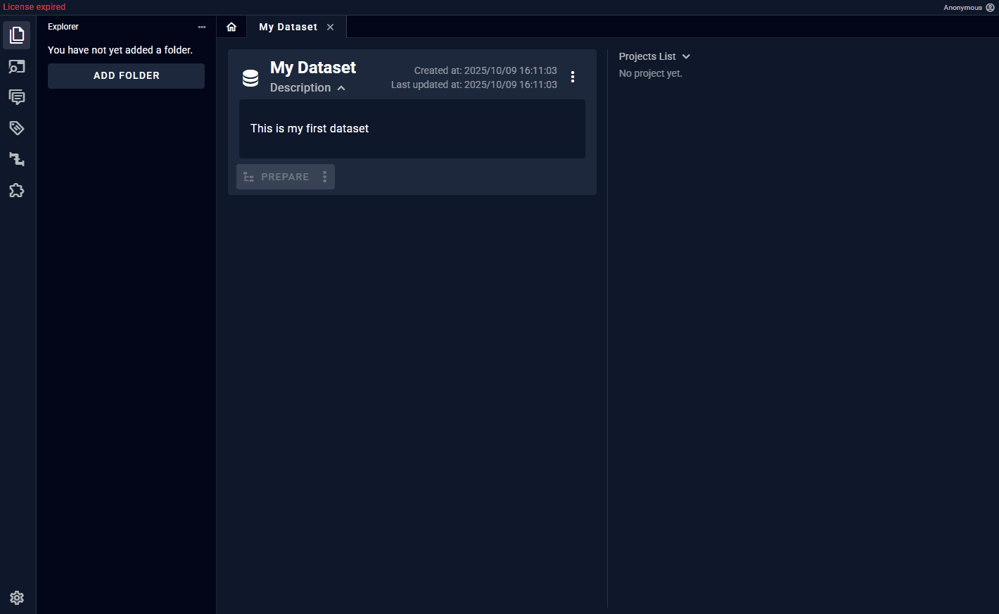
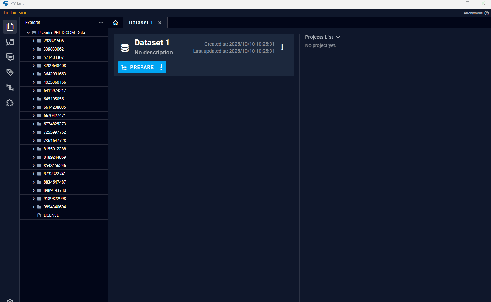
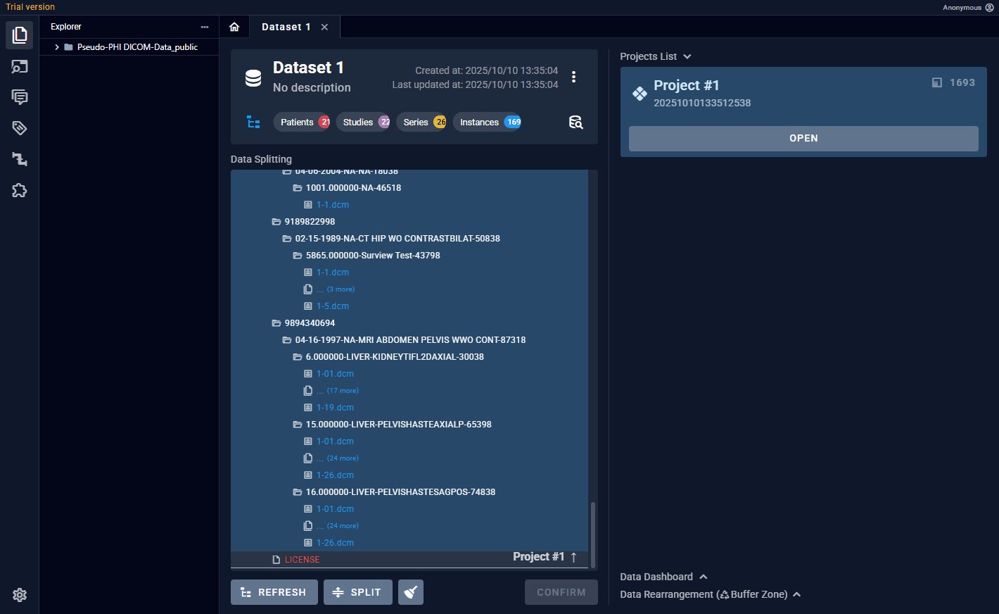
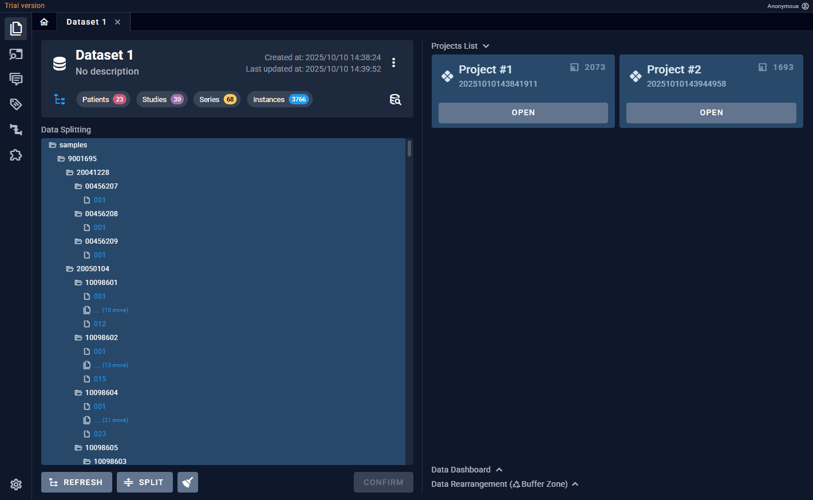

# 数据集页面

此页面可以进行以下操作：
- 从本地导入数据
- 数据检索
- 数据重排

## 从本地导入数据

### 添加数据并一键解析

操作流程：
1. 拖入文件夹到左侧真实文件目录区
2. 在数据准备区（中间区域）点击“Prepare”
3. Project区域在对应project上点击“Parse”
注意：多个project可以并行解析

### 手动分割
默认情况下，软件会自动根据用户设备的硬件情况分割合理大小的project。但用户也可以自行调整想要的project数量。

操作流程：
1. 点击数据准备区的prepare键右侧的三个点，选择“手动分割”
2. 点击底部的“分割”键，选择要分割出的project数量，然后点击“分割”

注意：本软件将会采用病人数据完整性原则，在自动分割时，避免同一个病人的数据被分割到不同project。为此采取了 **“自动合并”** 原则，即一个project的数据被解析完毕时，如果其中存在数据已经属于已存project，那么这些数据将会被自动移动到那些project中。比如：project1已经解析完毕，其中存在PatientA的数据，现在解析project2发现其中的data1也属于PatientA，那么data1就会被自动移动到project1。

### 增加新数据

操作流程：
1. 往左侧真是文件目录区拖入新的文件夹
2. 在数据准备区点击“刷新”键，可以看到新的文件被显示在中间区域。蓝色文件意味着数据已经被解析，灰色文件为未处理的文件。
3. 点击底部的“分割”键，选择新增project数量。此时会将灰色文件放入新增project。

数据准备区的文件颜色：
- 绿色：已纳入任意project的文件。
- 蓝色：已纳入任意project且已经被解析。
- 红色：非合法DICOM文件，包括无图像的DICOM文件和非DICOM格式的文件。
- 灰色：未纳入任何project的文件。

## 数据检索
用户可以对整个数据集中的数据进行总览

操作流程：
1. 点击“检索”图标，进入检索区，此时检索区会替换数据准备区
2. 在检索区的右上角点击“查询”图表，可以根据层级提交查询需求
3. 查询结果会显示在检索区内部

查询可选项：
- 数据集
- 项目
- 层级（Patient/Study/Series）
- DICOM标签（符合所选层级的DICOM Tag，可多标签检索）

在对于检索到的数据，可以展开其缩略图。

如果是检索Patient或Series层，右侧Dashboard区会自动显示相关维度的统计图表，如病人性别/年龄，模态/器官。

## 数据重排
Project中的数据是可以灵活调整的，调整的基本单位是Patient。比如，用户可以把PatientA从Project1移动到Project2。
除了直接移动数据，本软件还提供了数据缓存区，用户可以把任意数据暂时从Project抽离到缓存区，比如数据清洗的场景，缓存区就相当于数据回收站。

操作流程：
1. 先进入检索区
2. 在想要重排的数据右侧点击“移入缓存区”
3. 此数据会从原所属的Project中移除，并添加到右侧缓存区
4. 在缓存区中点击“移动”键，可以选择要移入的Project
5. 选择“删除”，数据就会从这个Dataset中移除，但仍然可以在检索区检索到

## 关闭数据集 & 返回主页
软件限制用户同一时间只能打开一个Dataset。因此需要先关闭当前Dataset才能打开新的。

1. 返回软件主页，但不退出当前Dataset。
2. 关闭整个Dataset，包括其选项卡中的全部内容。选项卡上的白色的上横条意味着它们都属于同一个Dataset。
3. 仅关闭指定Project

## Python运行环境