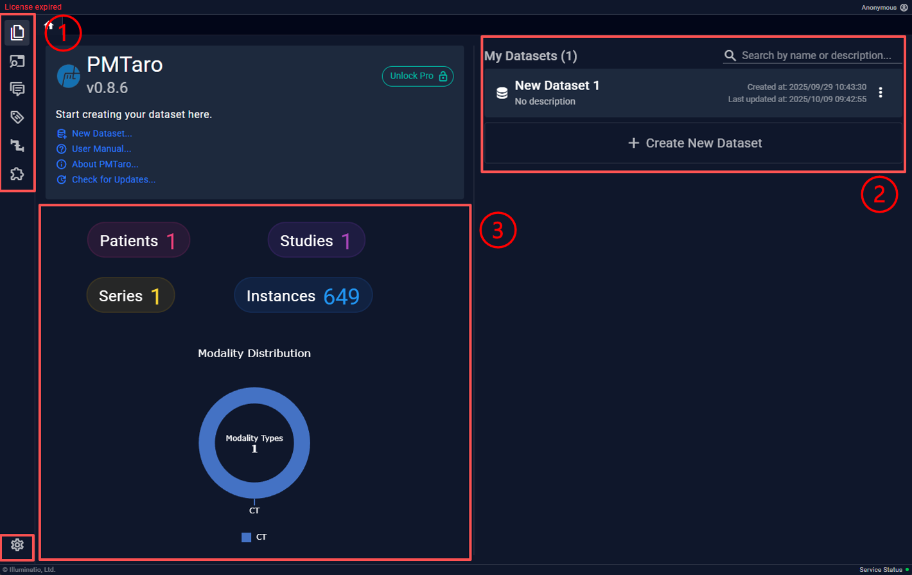
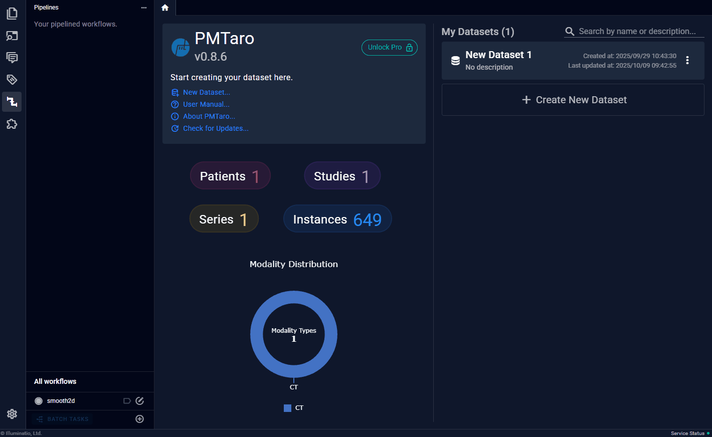

# 4.1 软件主页
打开软件界面后即进入主页，也代表了软件的核心操作区域

1. 功能区：从上到下依次为：
    - 原文件路径浏览器
    - 查看DICOM Tag
    - 报告书写
    - 数据标签
    - 工作流
    - 插件
2. 仪表盘：展示全部数据量和模态统计
3. 数据集列表：展示现存的全部数据集，可以创建新的或进入已有的

此页面可以进行以下操作：
- 创建数据集
- 打开数据集

## 创建数据集

按照如上操作创建数据集

## 打开数据集
创建数据集后，即可左键单击对应数据集条目，进入“数据集页面”

