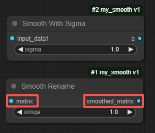
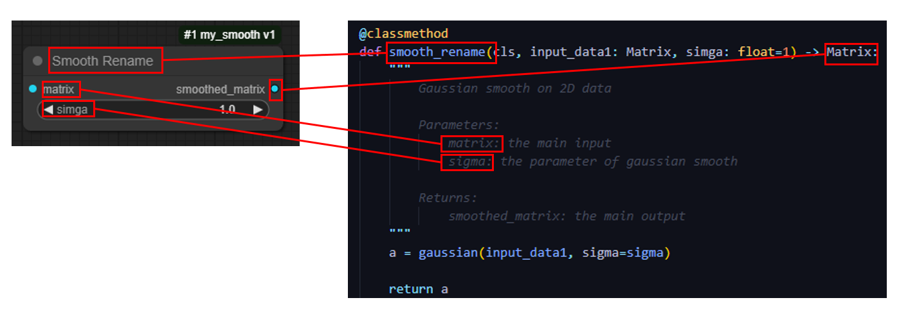

# 插件页
插件，对于本软件来说是一个标准化的数据处理模块。以固定类型的数据作为模块的输入输出。此外，插件在工作流中是一个处理节点。以下展示了一个最简单的图像滤波功能插件从制作到使用的全流程：


接下来详细讲解每个环节

## 初始化Python脚本
插件的本质只是一个Python脚本文件，用户需要按照约定的格式书写就可以实现插件的运行。
点击“初始化插件”，填写完自定义的插件名，插件描述和版本后，会自动生成一个 **模板Python文件**

以下是 **模板Python文件** 的内容：
```
from pmt_type import *
from pmt_type_options import *
from typing import Annotated, Tuple
# ======================= Please do not modify the above lines =======================

# ======================= Security Notice =======================
# 1. Dangerous operations like os.system() are blocked
# 2. You can use normal file operations 
#    - you can open files in anywhere, but writing will be redirected to safe directory
#    - If your plugin's output is any file type, you must save the file by urself and return the file name
# 3. Available helper functions:
#    - get_output_directory() -> str : get the address of the safe directory for read/write files
# For more details please refer to our user manual.
# ======================= End Security Notice =======================
# Your import goes here


class template:
    """
        plugin descriptions...
    """
    ### The following variables are mandatory
    VERSION = '1'
    EXECUTABLE_FUNCTION = ["example"]   # list the function name you want to execute in the Node
    
    
    # Your function correspond to EXECUTABLE_FUNCTION
    # The docstring must be in the requested format as below (like Google style)
    # The input / output variable name must be mentioned in the docstring
    # The input / output variable must be type hinting correctly with predefined types
    # For detail of hint types, please refer to documents or pmt_type.py  
    
    @classmethod
    @validate_annotations   # use to valid Array, Matrix, Volume's dims
    def example(cls, input_data1: CUSTOM) -> Tuple[CUSTOM, CUSTOM]:
        """
        Your function description here. You can write anything you want, 
        but remember to leaver one blank line after. If you following Google-style or reStructuredText, 
        you can customize parameters name and description, and the output name and description (like below).
        
        Parameters:
            input_data1: the name must be same as your first input's variable name

        Returns:
            output1_name: the output shown in the Node outputs
            output2_name: description of the output data
        """
        ### Your code goes here

        ### If you have two outputs, make sure mention them in the docstring in order
        a = input_data1
        b = 1

        return a, b   # order must align with the return type hint


if __name__ == "__main__":
    ### You can test your code here
    
    pass
```

以下是 **模板Python文件** 的内容讲解：
```
from pmt_type import *
from pmt_type_options import *
from typing import Annotated, Tuple
```
导入内置文件用于Python [Type Hint](https://peps.python.org/pep-0484/)。Type Hint是本软件主要自动注册插件的核心逻辑，用户只需要利用type hint的语法照常书写代码，无需额外为注册插件写配置文件。


```
class template:
    """
        plugin descriptions...
    """
    ### The following variables are mandatory
    VERSION = '1'
    EXECUTABLE_FUNCTION = ["example"]   # list the function name you want to execute in the Node

    @classmethod
    @validate_annotations   # use to valid Array, Matrix, Volume's dims
    def example(cls, input_data1: CUSTOM) -> Tuple[CUSTOM, CUSTOM]:
```
插件描述和版本都是用户在初始化插件的时候自定义的。

**EXECUTABLE_FUNCTION** 代表了要暴露出的插件函数，也就是插件真正的可执行模块。一个插件脚本文件中可以包含N个插件的可执行模块。其数组中包含的字符串必须是类方法中的存在的。在这个例子中，数组的值里有“example”，所以下方的example类方法会暴露出去。

注意：有且仅有包含**EXECUTABLE_FUNCTION**属性的类会被当作插件类。

```
    @classmethod
    @validate_annotations   # use to valid Array, Matrix, Volume's dims
    def example(cls, input_data1: CUSTOM) -> Tuple[CUSTOM, CUSTOM]:
```
**@classmethod** 必选，类方法装饰器。用于作为插件的函数必须是类方法。
**@validate_annotations** 可选，本软件自定义。用于验证输入输出数据是否真正符合注释要求，如可为Matrix类添加"col=2, row=3"的注释，使用此装饰器即可自动对输入的Matrix数据进行维度验证。

插件函数中的输入输出都必须带有type hint。此例子中的**CUSTOM**仅作为占位符，在实际的插件中要被替换为有效类型。软件允许使用的类型参见下章：

## 例子
以高斯平滑为例写一个最简化的插件 (删除了注释)
```
from pmt_type import *
from pmt_type_options import *
from typing import Annotated, Tuple

# Your import goes here
from skimage import filters

class my_smooth:
    """
        Gaussian smooth
    """
    VERSION = '1.0'
    EXECUTABLE_FUNCTION = ["smooth"] 

    @classmethod
    def smooth(cls, input_data1: Matrix) -> Matrix:
        result = filters.gaussian(input_data1, sigma=1, preserve_range=True)
        return result   
```
上面的代码使用了Ski-image库再带的高斯平滑函数。输入数据为二维数组，因此使用Matrix类，输出数据为等尺寸的二维数组，因此类型也是Matrix。以这样的方式注册的插件，在工作流中显示为（下图）：


## 增加参数
紧跟上一个例子，gaussian的sigma是一个超参数，应该因工作流不同而可以随时被更改。为此可以这样修改函数头：
```
    @classmethod
    def smooth(cls, input_data1: Matrix, sigma: float=1) -> Matrix:
```
语法与Python书写习惯一致,但要注意，作为参数存在的属性必须有默认赋值，如果这样写，那么在工作流中将完全不同：
```
    @classmethod
    def smooth(cls, input_data1: Matrix, sigma: float) -> Matrix:
```
因为此时sigma会被当做独立的输入，而不是参数。对比效果参见下图


## 自定义描述
以上例子都是软件会自动根据用户书写的语法给输入输出定义名称，但用户也可以自定义，见如下代码
```
    @classmethod
    def smooth_rename(cls, input_data1: Matrix, simga: float=1) -> Matrix:
        """
            Gaussian smooth on 2D data

            Parameters:
                matrix: the main input
                sigma: the parameter of gaussian smooth

            Returns:
                smoothed_matrix: the main output
        """
        a = gaussian(input_data1, sigma=sigma)

        return a
```
任何Google-style或reStructure Text都可以被软件识别，工作流中的插件节点就会随之变化。


## 代码与工作流节点的关系

插件需求总结： 
 - 函数的输入 → 节点的输入
 - 带有默认值的输入 → 节点的可调超参数
 - 函数的输出 → 节点的输出
 - 输入输出和参数类型  → 节点类型 （同类型可相连，详见工作流章节）
 - docstring → 节点各元素的自定义命名 


## 即时测试
用户可以直接在插件界面的IDE区运行代码，此时插件运行不受沙箱限制。


## 默认Python运行环境
插件和工作流默认运行在本软件自带的python环境（pmtaro_1.2），用户可以在设置页或插件和工作流页的下方切换为其他环境。默认环境与其他python环境并无二至，用户可以自行查看和安装其他库到其中。


## Type Hint & Pipeline类型
| type hint | Python变量类型 | pipeline类型 | 类标注 | Annotated参数 | 说明 |
| -- | -- | -- | -- | -- | -- |
| str | str | STRING | StringOptions | {multiline=False, regx=True, usage=None, enum=[]} | -- |
| int | int | INT | IntOptions | {min=None, max=None, step=None} | -- |
| float | float | FLOAT | FloatOptions | {min=None, max=None, step=None} | -- |
| bool | bool | BOOLEAN | BooleanOptions | {usage=None} | -- |
| dict | dict | DICT | DictOptions | {enable_add=False} | -- |
| Array | np.array | 1D | ArrayOptions | {dim=None, dim_desc=None} | 任意长度的一维数据，可以通过annotated参数定义更具体的维度尺寸 |
| Matrix | np.array | 2D | MatrixOptions | {first_dim=None, second_dim=None, first_dim_desc=None, second_dim_desc=None} | 任意尺寸的二维矩阵，可以通过annotated参数定义更具体的维度尺寸 |
| Volume | np.array | 3D | VolumeOptions | {fisrt_dim=None, second_dim=None, third_dim=None, fisrt_dim_desc=None, second_dim_desc=None, third_dim_desc=None} | 任意尺寸的三维矩阵，可以通过annotated参数定义更具体的维度尺寸 |
| VolumeT | np.array | 4D | StringOptions | {fisrt_dim=None, second_dim=None, third_dim=None, fourth_dim=None, fisrt_dim_desc=None, second_dim_desc=None, third_dim_desc=None, fourth_dim_desc=None} | 任意尺寸的四维矩阵，可以通过annotated参数定义更具体的维度尺寸 | 
| DataFrame | pandas.DataFrame | TABLE | -- | -- | pandas Dataframe数据 |
| DICOM_FILE | str | DICOM_FILE | -- | -- | DICOM文件路径 |
| NIFTI_FILE | str | NIFTI_FILE | -- | -- | NIFTI文件路径 |
| IMAGE_FILE | str | IMAGE_FILE | -- | -- | 常规图像格式的文件路径 |
| JSON_FILE | str | JSON_FILE | -- | -- | JSON文件路径 |
| FILE | str | FILE | FileOptions | {file_upload=False, extensions=['*']} | 任意文件路径 | 
| PATIENT | list | PATIENT_FILE_LIST | -- | -- | 包含N个STUDY_FILE_LIST的JSON结构，结构如下：[{"study_UID": <str>, "study_description": <str>, "study_list": <STUDY_FILE_LIST>}, ...]
| STUDY | list | STUDY_FILE_LIST | -- | -- | 包含N个SERIES_FILE_LIST的JSON结构，结构如下：[{"series_UID": <str>, "series_description": <str>, "series_list": <list>}, ...]
| SERIES | list | SERIES_FILE_LIST | -- | -- | 包含组合成一个完整Series的DICOM文件路径的数组 |
| DICOM_FILE_LIST | list | DICOM_FILE_LIST | -- | -- | 包含任意DICOM文件路径的数组 | 

### Annotated的使用方法：
代码示例：
```
    sigma_with_options = Annotated[float, FloatOptions(min=0, max=50, step=0.1)]
    
    @classmethod
    def get_dicom_from_dicom_list(data: SERIES, sigma: sigma_with_options=0.3) -> DICOM_FILE:
```
只需要遵循Python type hint的标准语法逻辑，但是用本软件定义的Annotation类（如FloatOptions）即可


## 另存为
如果用户修改了插件中主类的名称，当用户存储时，就会提示是否需要另存为。因为插件的调用是由主类的名称直接决定的，修改了这个名称也就会导致修改了插件的命名。