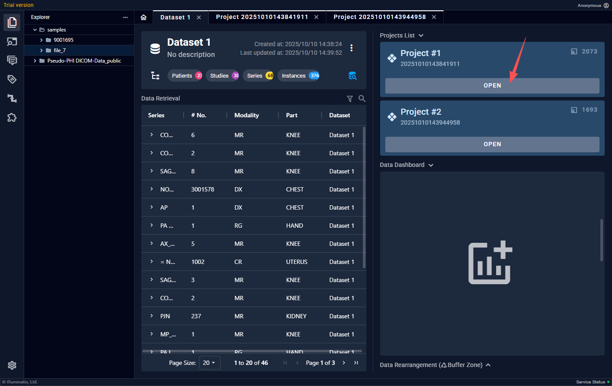
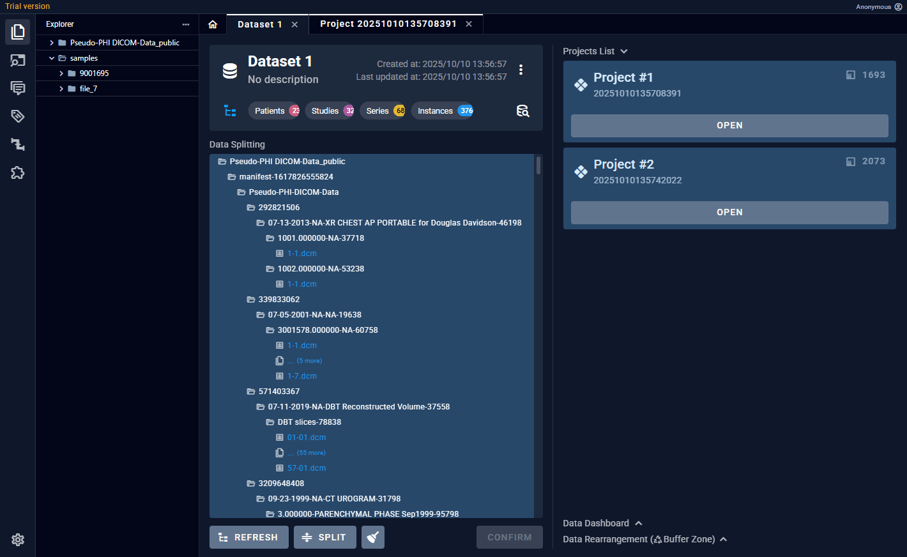
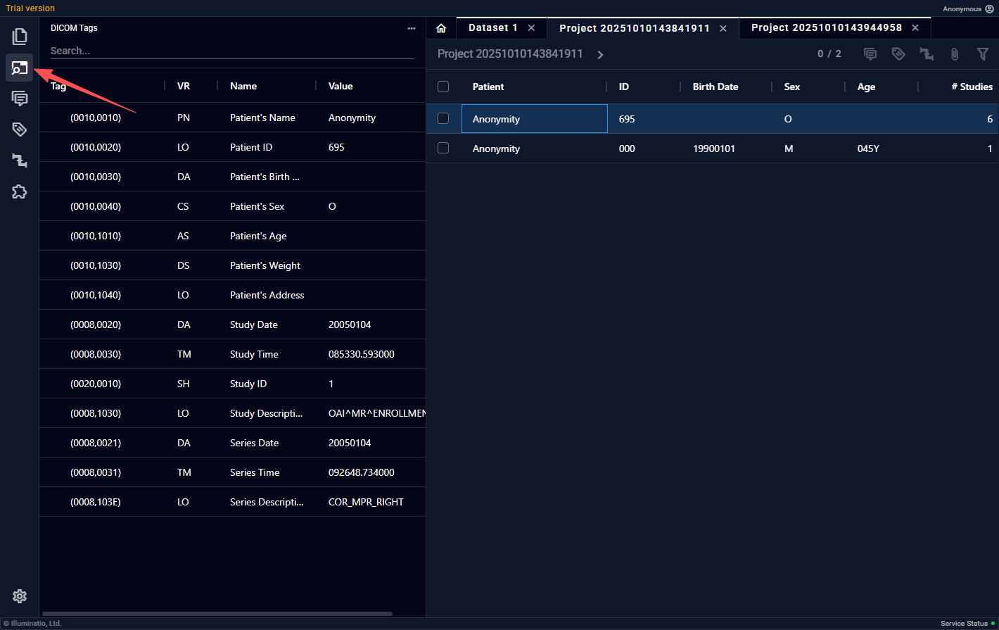
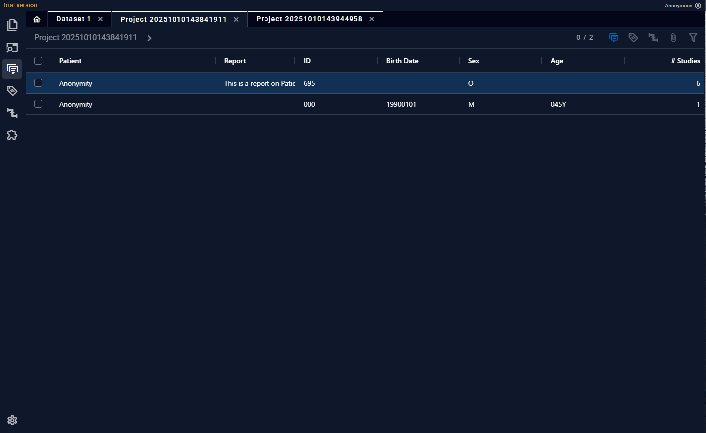
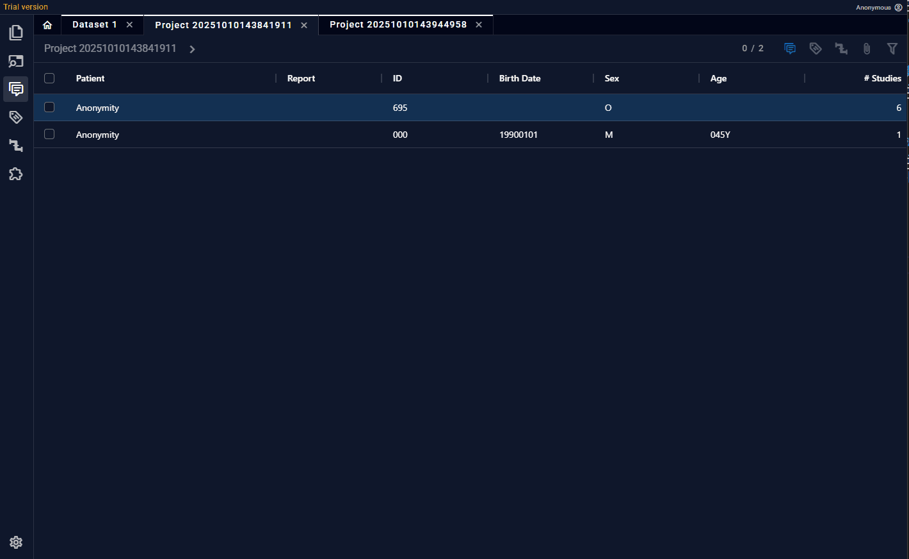
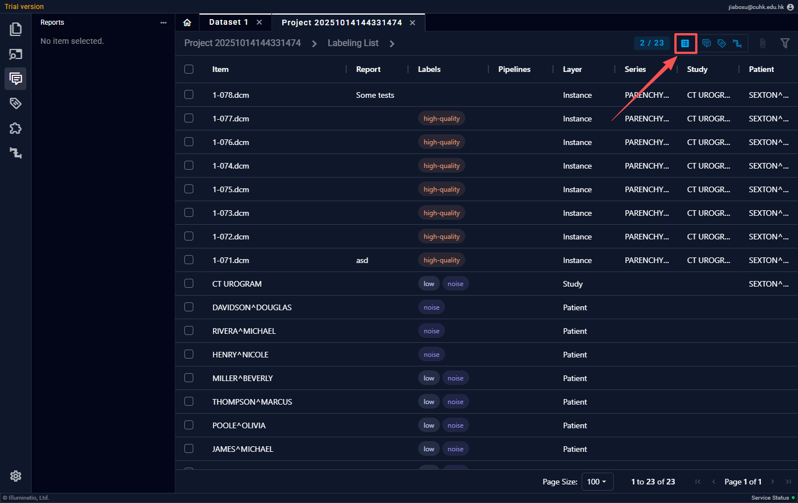
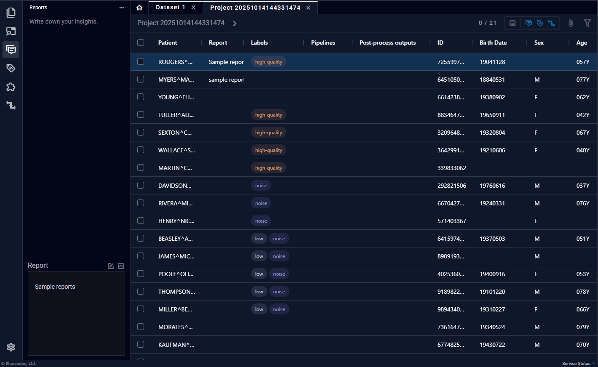

# 项目页面
项目页面是用户操作数据的主要页面，包含了此项目的全部DICOM数据，非DICOM附件，影像报告，元信息等。

数据以Patient-Study-Series-Instance的四层树状结构展示。

## 进入项目页面

解析完的project下面会显示“进入”，点击即可。

## 浏览数据&读图

每层数据都可以 **鼠标左键双击** 进入下一层，在Series层双击会自动打开读图区域，且在下方显示整个Series的缩略图。

## 查看DICOM标签

DICOM标签在不同层级显示不同内容，Patient层显示Patient相关tag，如Patient ID， Patient Name;Study层，如Study Time;Series层，如Modality

## 自定义标签

在功能区中选择“标签”，用户可以添加自定义的标签，选中任意层级数据后，即可将标签增加/删除在上面。

标签可以使用过滤器，通过关键字快速找到目标数据。

## 层级报告

与打标签的操作相似，每一层级也都可以添加文本内容，当前层级除了可以看到本层内容，还可以以摘要的形式获取下层文本。一个病人的每层文本综合起来会组成这个病人的“影像报告”，并允许以结构化文本（XML，JSON）的形式导出。

## 列表视图

列表视图主要用于全局对数据进行标签管理。非列表视图只能看到同层数据的状况，当不同层级数据均带有标签时，不能很好地进行标签管理。列表视图会以平铺的方式展示所有带有标签，报告和工作流标签的数据。用户也可以在此视图下对数据标签进行编辑，如增减新的标签

## 过滤器 & 排序

用户可以根据多种过滤规则对每列数据进行过滤，进一步提升数据管理效率。也可以对任意列进行排序。

## 快捷键
为了方便用户的快速数据管理，本软件提供了大量快捷键操作。下面表格中列出全部快捷键，用户可在“设置 - 快捷键”找到。多数窗口相关的快捷键操作与常见浏览器一致。

| 操作 | 快捷键 |
| - | - |
| 展开文件浏览器（左侧功能区）| F1 |
| 展开DICOM Tag浏览器 | F2 |
| 展开报告撰写区 | F3 |
| 展开标签区 | F4 |
| 展开插件区 | F5 |
| 展开工作流区 | F6 |
| 放大 | Ctrl + = |
| 缩小 | Ctrl + - |
| 还原缩放 | Ctrl + 0 |
| 切换到Tab{1-9} | Ctrl + {1-9} |
| 切换到下一个Tab | Ctrl + Right / Ctrl + Tab |
| 切换到上一个Tab | Ctrl + Left / Ctrl + Shift + Tab |
| 关闭当前Tab | Ctrl + W |
| 任意文本编辑区： 保存报告/代码 | Ctrl + S |
| 标签区：添加{1-9}号位的标签 | Alt + {1-9} |
| 工作流区：添加{1-9}号位的工作流标签 | Alt + {1-9} |
| 项目页面：退出阅片 | Shift + Esc |
| 项目页面：退回上层 | Shift + Backspace |