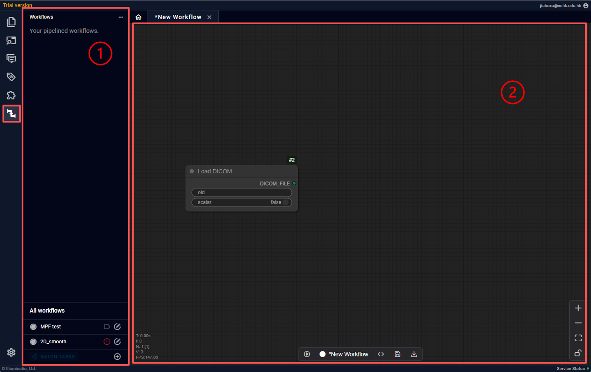
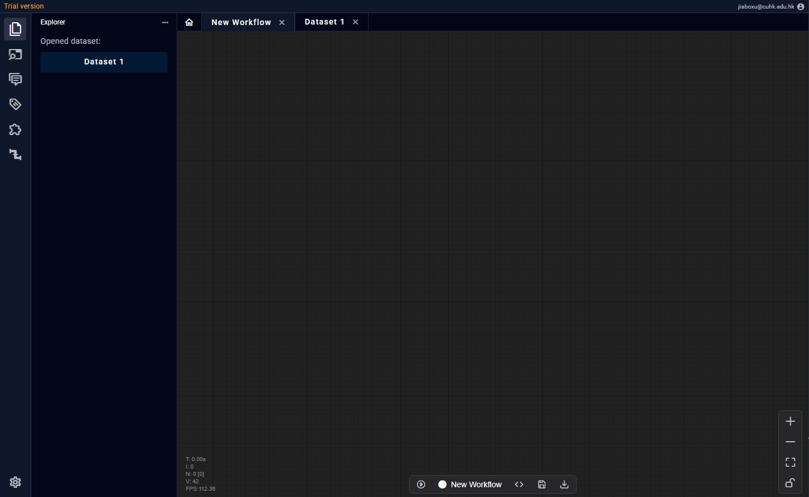
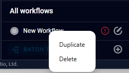
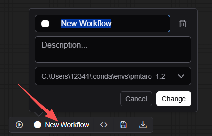

# 工作流页

工作流页由左侧功能区打开，开启后界面分为两块：
1. 已存工作流标签区：用于使用已有的工作流
2. 当前工作流操作区：用于单次运行或编辑当前工作流

在工作流页可以进行一下操作：
- 创建工作流
- 复制/删除/重命名工作流
- 编辑当前工作流
- 运行当前工作流

## 创建/编辑工作流

工作流由N个节点串联组成，节点与节点之间可以相连。连接规则仅为同类型可连。一个节点的输入必须都有连接（可选输入除外），但对输出没有要求。可以理解为要想运行节点就必须满足它的输入，但是它的输出并不一定都用得到。对工作流的任何编辑都需要点击下方的“保存键”进行确认。

节点分为以下几类：
- 输入节点
- 转换节点
- 插件节点
- 输出/预览节点
接下来对以下节点分别描述

### 输入节点

作为数据流的起点，输入节点不允许用户自定义，必须使用软件预设的几个节点（如上图）。主要分为DICOM加载类和常量类。

DICOM加载类必须以DICOM层级数据为输入，输入一定都是DICOM文件，且这些文件必须来自软件内已存的数据集。目前提供：
 - DICOM输入节点：用户可以拖动Instance层数据放入此节点
 - Series输入节点：用户可以拖动Series层数据放入此节点。当“过滤”开启时，用户可以选择以当前Series内的特定Instance作为输出，同时可以以Series为输入（详见）
 - Study输入节点：用户可以拖动Study层数据放入此节点。当“过滤”开启时，用户可以选择以当前Series内的特定Instance作为输出
 

输入节点可以彼此嵌套，如 study → series 最后以instance为输出。

### 转换节点

## 复制/删除/重命名工作流

对于已经存储的工作流，右键可以进行复制/删除操作

点击工作流操作区下方的工作流名称，可以修改标签颜色，名称和运行环境（与插件环境相同）

## 运行当前工作流